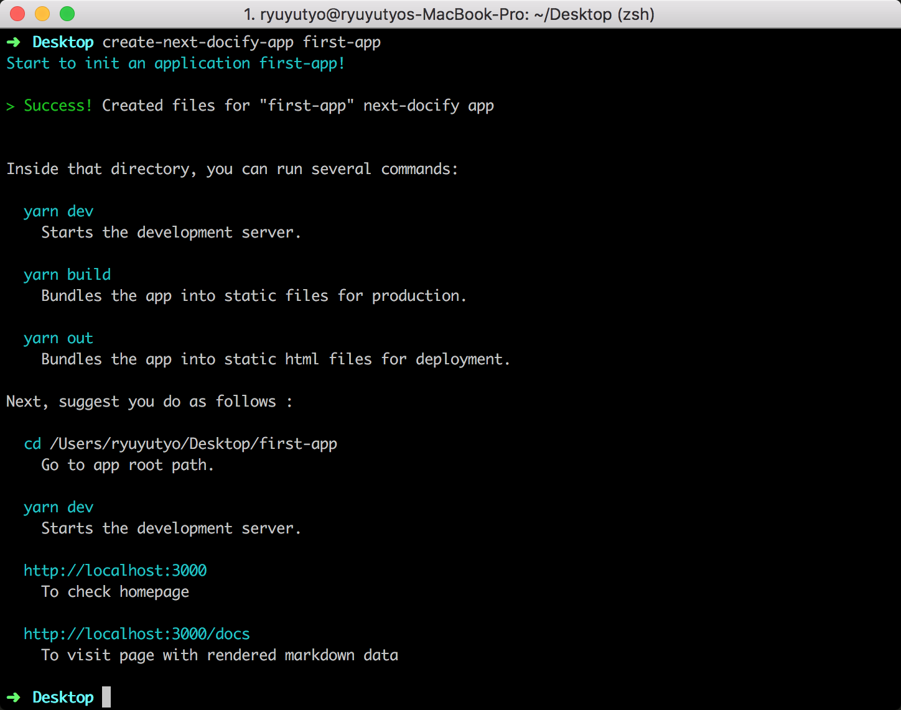
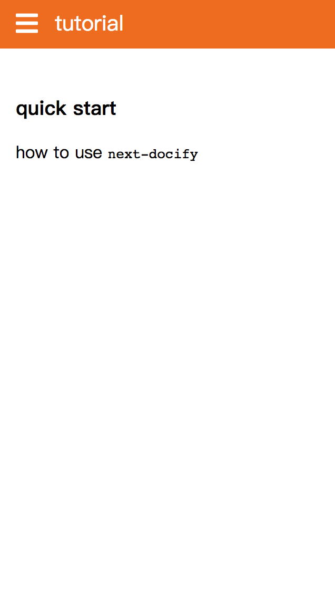

# create-next-docify-app &middot; [](https://www.npmjs.com/package/create-next-docify-app) [](http://www.npmtrends.com/create-next-docify-app)

`create-next-docify-app`是专门针对`next-docify`的`cli`工具；类似[create-react-app](https://github.com/facebook/create-react-app)和[create-next-app](https://github.com/segmentio/create-next-app)可以快速搭建起`next-docify`服务，所以在设计和实现上都有很多的参考。

## 安装

```bash
npm install -g create-next-docify-app
```

## 快速入门

---

- [查看帮助文档](#查看帮助文档)
- [创建应用](#创建应用)
- [应用开发](#应用开发)

### 查看帮助文档

```bash
create-next-docify-app --help
```

### 创建应用

```bash
create-next-docify-app first-app
```



### 选择模版

可以通过设置`-t` option来选择不同的模版，默认情况是`default`；比如通过下面方式使用`document`模版

```bash
create-next-docify-app first-app -t document
```




### 应用开发

[next-docify - 基于Next.js的静态网站生成工具](https://github.com/ryuever/next-docify/tree/master/packages/next-docify)